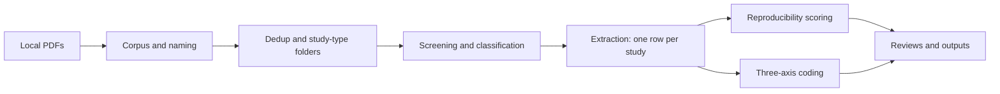
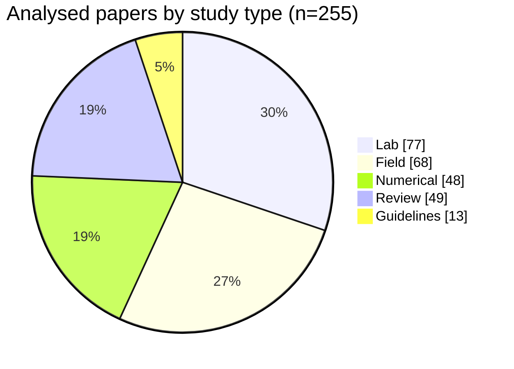

# Downstream Fish Passage Injury and Mortality Knowledge Base

> 📊 **[Open the interactive dashboard →](https://jtuhtan.github.io/downstream-fish-passage-injury-mortality-knowledge_base/)** — browse the evidence, charts and reproducibility tiers in your browser.
> 🔬 **[Open the stressor–response explorer →](https://jtuhtan.github.io/downstream-fish-passage-injury-mortality-knowledge_base/stressor_response.html)** — thresholds, dose–response and equations linking physical stressors (pressure, shear, blade strike…) to injury and mortality; **91 runnable dose–response models across barotrauma, blade strike & fluid shear**, each on its own dose axis.
> *(Clicking a `docs/*.html` file inside the repo only shows its source code — use these links to actually run them. No download or GitHub account needed.)*

A community knowledge base on **how fish are injured and killed during downstream
passage** through hydropower turbines, pumps, Archimedean screws, weirs,
spillways and bypasses — and on **how reliably we actually know it**.

It has two jobs:

1. **Keep an up-to-date, structured literature review** of the field — organised
   by injury mechanism, with thresholds, species, life stages, fish sizes and
   study parameters — plus a focused deep-dive on **barotrauma metrics and the
   reproducibility of live-fish studies**.
2. **Document a rigorous, repeatable methodology** for how the base is built,
   maintained and updated, so anyone can reproduce or extend it.

> **Status:** v0.23.1. Three mechanism modules (barotrauma, collision, shear)
> with reproducibility scorecards; a three-axis framework (mechanism × exposure
> pathway × outcome timing) coded across all **255 analysed
> papers**; a cross-mechanism synthesis and gap matrix; and a literature-discovery
> skill with a ranked candidate-additions list. See [CHANGELOG.md](CHANGELOG.md).
## Visual overview

**▶ [Explore the interactive dashboard](https://jtuhtan.github.io/downstream-fish-passage-injury-mortality-knowledge_base/)** — a filterable evidence table, coverage charts, live-fish reproducibility tiers and the candidate-additions list, all built from the CSVs in [`data/`](data/). It is a static page served from [`docs/`](docs/) (no PDFs); rebuild it with `python scripts/build_dashboard.py` after any data change.

### How the base is built

### Coverage at a glance

GitHub renders the diagrams above natively; the interactive charts live on the dashboard.

## What's inside

| Path | Contents |
|---|---|
| [`data/`](data/) | **Machine-readable source of truth (CSV).** Bibliography, extraction table, barotrauma, collision & shear registers & reproducibility scorecards, metrics catalogues, the cross-cutting exposure/timing axes table, the candidate-additions (discovery) list, controlled vocabularies. No PDFs. |
| [`reviews/`](reviews/) | Human-readable synthesis: state-of-the-art review; focused barotrauma / collision / shear overviews; and the cross-mechanism synthesis. |
| [`methodology/`](methodology/) | The documented, repeatable pipeline (corpus → screening → extraction → reproducibility → axes → updates). |
| [`skills/`](skills/) | Reusable skills: **passage-injury-mortality-review** (extraction & synthesis) and **passage-literature-discovery** (gap-driven discovery of works to add). |
| [`scripts/`](scripts/) | Extraction and build scripts. |
| [`outputs/`](outputs/) | Generated artefacts (Excel/Word) built from `data/` + `reviews/`. |
| [`docs/`](docs/) | The interactive dashboard (`index.html`) published via GitHub Pages; regenerated by `scripts/build_dashboard.py`. |
| [`tools/`](tools/) | The offline **verification tool** (`verification/verify.py`) for confirming each row against its PDF. |

## Important: no source PDFs

This repository **does not contain the research publications themselves** — they
remain under their publishers' copyright. It holds bibliographic metadata
(including DOIs in [`data/corpus.csv`](data/corpus.csv)), derived data and
original summaries. To read a paper, use its DOI; to cite a finding, cite the
original publication.

## How to use it

- **Browse the evidence:** open `data/extraction.csv` (one row per study) and
  filter by mechanism, species, life stage or study type.
- **Query the three axes:** join `data/axes_exposure_timing.csv` (mechanism ×
  exposure pathway × outcome timing) on `citation_key`; roll taxa up via
  `family` / `family_group` in `data/vocab/species.csv`.
- **Assess reproducibility:** see the per-mechanism scorecards
  (`data/barotrauma_reproducibility_scorecard.csv`,
  `data/collision_reproducibility_scorecard.csv`,
  `data/shear_reproducibility_scorecard.csv`) and the matching `reviews/` overviews.
- **See the big picture & gaps:** `reviews/cross_mechanism_synthesis.md` and
  `outputs/Cross_mechanism_gap_matrix.xlsx`.
- **Find what to add next:** `data/candidate_additions.csv` and
  `reviews/candidate_additions.md` — ranked, theme-tagged works missing from the
  collection (from the `passage-literature-discovery` skill).
- **Reproduce / extend:** follow [`methodology/`](methodology/) and run
  `scripts/extract_passage_data.py` on a folder of PDFs.

## Scope & definitions

"Downstream passage" covers fish moving downstream through or over hydraulic
structures. Injury mechanisms follow the controlled vocabulary in
[`data/vocab/mechanisms.csv`](data/vocab/mechanisms.csv): blade strike,
barotrauma, shear, cavitation, turbulence, grinding/abrasion, gas
supersaturation, and entrainment/impingement.

## Coverage at a glance (v0.14.0)

- 272 catalogued publications (1928–2026); 255 analysed across Review / Lab /
  Field / Numerical / Guidelines (27 added from the candidate list).
- Barotrauma deep-dive: 66 barotrauma papers; 39 live-fish studies scored for
  reproducibility of reporting.
- Collision (blade strike & impact) deep-dive: 53 collision papers; 25 live-fish
  studies (9 simulated-strike + 16 field-observed) scored.
- Shear (fluid shear / strain rate) deep-dive: 39 shear papers; 12 live-fish
  studies (lab jet/flume) scored. Field live-fish shear evidence is effectively
  absent (shear is studied almost entirely in the laboratory).
- Three-axis framework: every study is described by **mechanism** x **exposure
  pathway** (study environment + location during passage) x **outcome timing**.
  The two cross-cutting axes are coded once per study in
  `data/axes_exposure_timing.csv` (all 255 papers; see
  `methodology/07_axes_exposure_and_timing.md`).
- Cross-mechanism synthesis & gap matrix: `reviews/cross_mechanism_synthesis.md`
  and `outputs/Cross_mechanism_gap_matrix.xlsx` (coverage by mechanism x family
  group x environment x outcome timing, with explicit data gaps).
- Literature discovery: 38 candidate works still cited by the collection but
  missing from it, ranked and theme-tagged in `data/candidate_additions.csv` (8
  High priority), with **ISO 4 / LTWA** short titles and a `candidate_link` +
  `pdf_url` per row (open-access/landing link where one exists), via the
  `passage-literature-discovery` skill. Invalid/duplicate candidates are logged in
  `data/candidate_removals_log.csv`.
- Verification: a documented, offline, PDF-in-hand protocol confirms each row
  against its source (`methodology/08_verification_protocol.md` +
  `tools/verification/verify.py`, which logs provenance to
  `data/verification_log.csv`). **All 255 extraction rows are currently `Mined`**
  pending that pass.

## Publishing the dashboard (GitHub Pages)

The dashboard is a single self-contained `docs/index.html`. To publish it once:

1. Push the repo (including `docs/`) to GitHub.
2. Repo **Settings → Pages → Build and deployment → Source: _Deploy from a branch_**.
3. Choose your default branch and the **`/docs`** folder, then **Save**.
4. After ~1–2 minutes the site is live at
   `https://jtuhtan.github.io/downstream-fish-passage-injury-mortality-knowledge_base/`.

To update it, edit the CSVs in `data/`, run `python scripts/build_dashboard.py`,
and commit the regenerated `docs/index.html`. (The `_Deploy from a branch_` source
serves the file as-is — no build step or GitHub Actions workflow is needed.)

## How to cite

See [CITATION.cff](CITATION.cff). Please also cite the **original publications**
for any specific finding (DOIs in `data/corpus.csv`).

## Contributing

Additions and corrections are welcome — see [CONTRIBUTING.md](CONTRIBUTING.md).
The golden rule: **never commit PDFs**; add a bibliographic row + extracted data.

## Licensing

- **Code** (`scripts/`, `skills/`): [MIT](LICENSE-CODE)
- **Data & documentation** (`data/`, `methodology/`, `reviews/`, docs):
  [CC BY 4.0](LICENSE-DATA)

## Maintainer

Jeffrey A. Tuhtan (Tallinn University of Technology) · https://github.com/jtuhtan
